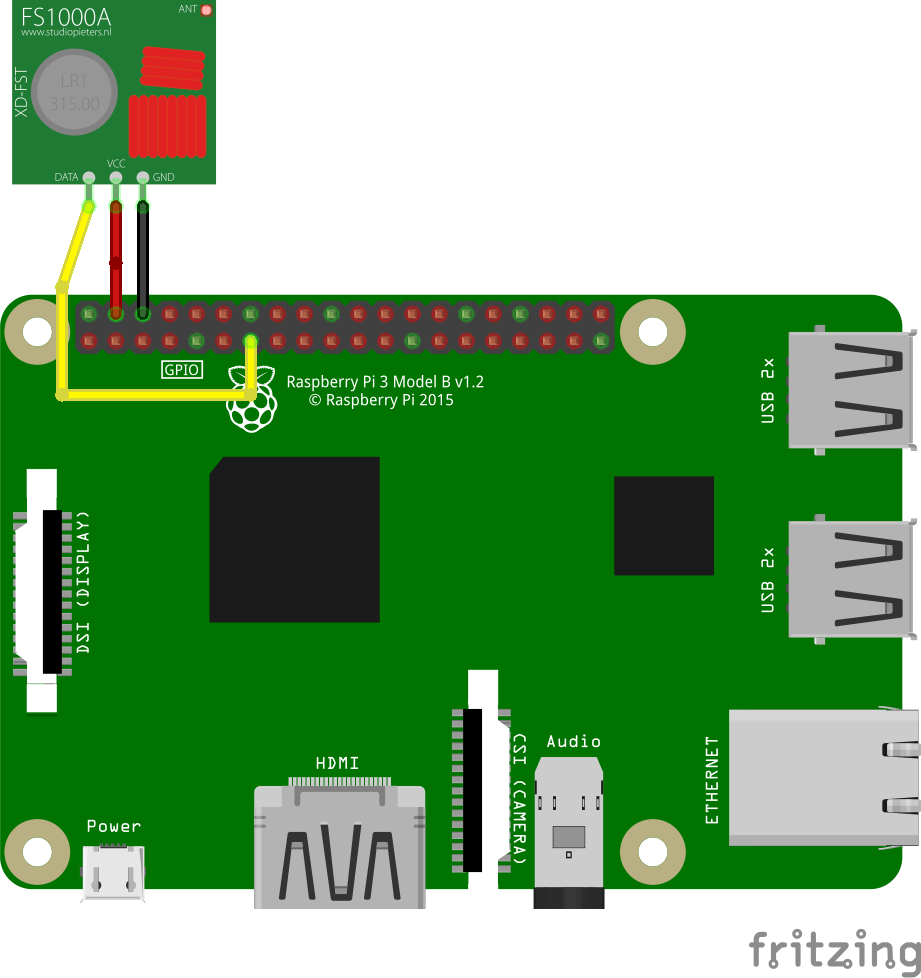

# homebridge-rc433-motion-sensor
This Homebridge plugin enables you to control a 433 MHz motion sensor. All you need is a 433 MHz receiver.

## Setup

1) Wire a 433 MHz receiver to your Raspberry Pi.



2) Install this plugin

```bash
npm i -g homebridge-contact-sensor
```

3) Rename the sample-config.json to config.json and integrate your sensors in the accessories array. The pins
of the Raspberry Pi require root rights to control them. Therefore you have to save your config file not
in your users directory. Put it under `/root/.homebridge/config.json` and run homebridge as root.
If you are already running homekit with other apps integrate the accessories into your config.json
and move your config file to the path above.

Accessory JSON config looks like:

```bash
{
      "accessory": "MotionSensor433MHz",
      "name": "MotionSensor433MHz1",
      "pin": 2,
      "on": 5510485,
      "off": 5510484
}
```
